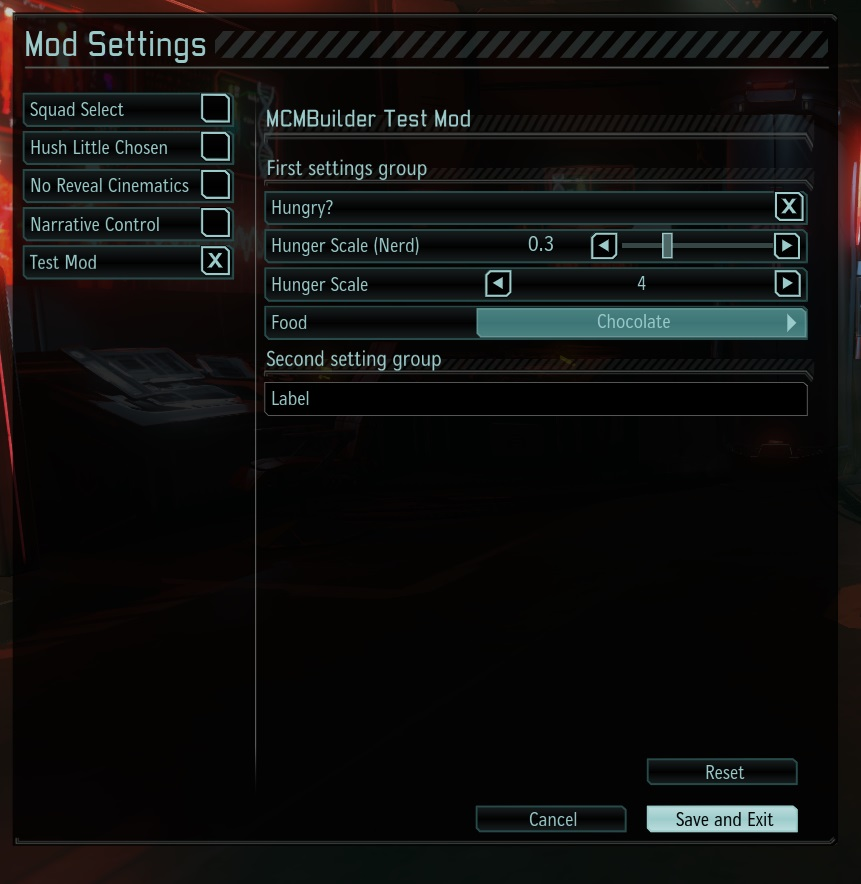

# MCMBuilderClientTestMod
## MCM Builder

MCM Builder provides a new way of creating MCM Pages.
Instead of writing the mcm code the pages are completely generated from a json config.
Lets get right down to it and have a look at this example config:

```
[ModConfigMenuBuilder.MCM_Builder_Screen]
+MCMBuilder="MCMBuilderClientTestMod"

[MCMBuilderClientTestMod JsonConfig_MCM_Builder]
+MCMPages = { \\
	"TESTMOD_SETTINGS_PAGE":{ \\
		"SaveConfigManager": "MCMBuilderClientTestModConfigManager",\\
		"EnableResetButton": "true", \\
		"TESTMOD_SETTINGS_GROUP_1":{ \\
			"HUNGRY":		{ "Type": "Checkbox" }, \\
			"HUNGER_SCALE_NERD":	{ "Type": "Slider", "SliderMin": "0.0", "SliderMax": "1.0", "SliderStep":"0.1" }, \\
			"HUNGER_SCALE":		{ "Type": "Spinner", "Options": "1, 2, 3, 4, 5, 6, 7, 8, 9, 10" }, \\
			"FOOD":			{ "Type": "Dropdown", "Options": "Apple, Chocolate, Burger" }, \\
		}, \\
		"TESTMOD_SETTINGS_GROUP_2":{ \\
			"A_LABEL":		{ "Type": "Label" }, \\
		}, \\
	}, \\
}
```

This small config is enough to generate a complete MCM page.
Lets have a look at the elements in detail.

### Pages and Groups

```
TESTMOD_SETTINGS_PAGE
TESTMOD_SETTINGS_GROUP_1
TESTMOD_SETTINGS_GROUP_2
```
are mcm page or group identifiers that are used to for localization mapping:
`MusashisModToolbox.int`
```
[MCMBuilderClientTestMod JsonConfig_MCM_Builder]

TESTMOD_SETTINGS_PAGE_TITLE="Test Mod"
TESTMOD_SETTINGS_PAGE_LABEL="MCMBuilder Test Mod"

TESTMOD_SETTINGS_GROUP_1_LABEL="First settings group"
TESTMOD_SETTINGS_GROUP_2_LABEL="Second setting group"
```

There are two special config properties:

`"SaveConfigManager": "MCMBuilderClientTestModConfigManager"`

This references the config manager you want to use to get default config properties and thats responsible to save your properties to the user config directory.

`"EnableResetButton": "true"`

this just tells the builder if you want to display a reset button on your page.

### Elements
```
"HUNGRY":		{ "Type": "Checkbox" }, \\
"HUNGER_SCALE_NERD":	{ "Type": "Slider", "SliderMin": "0.0", "SliderMax": "1.0", "SliderStep":"0.1" }, \\
"HUNGER_SCALE":		{ "Type": "Spinner", "Options": "1, 2, 3, 4, 5, 6, 7, 8, 9, 10" }, \\
"FOOD":			{ "Type": "Dropdown", "Options": "Apple, Chocolate, Burger" }, \\
```

These are the actual mcm elements that are displayed.
The identifiers (like "HUNGRY") are actual referencing config properties from the JsonConfigManager System.

localization works the same as with pages and groups:
Just define localization properties following the convention:
```
<PROPERTY_NAME>_LABEL
<PROPERTY_NAME>_TOOLTIP
```
e.g.
```
HUNGRY_LABEL="Hungry?"
HUNGRY_TOOLTIP="Are you hungry?"
```

## Client Side Integration
You will need to add the package
**ModConfigMenuBuilderAPI_1_0_0** from **ModConfigMenu** to your mod project


```
[Engine.ScriptPackages]
+NonNativePackages=ModConfigMenuBuilderAPI_1_0_0
+NonNativePackages=MCMBuilderClientTestMod

[UnrealEd.EditorEngine]
+ModEditPackages=ModConfigMenuBuilderAPI_1_0_0
```

Then you need two config files and a localization file:
(this example assumes you mod safe name is **YourMod**

- `Config/XComJsonConfigManager.ini`
- `Config/XComMCMBuilder.ini`
- `Localization/ModConfigMenu.int`

Lets see there contents in detail:

##### `XComMCMBuilder.ini`
```
[ModConfigMenuBuilder.MCM_Builder_Screen]
+MCMBuilder="YourModMCMPage1" ;can be any name but have to match below and in the localization file

[YourModMCMPage1 JsonConfig_MCM_Builder]
+MCMPages = { \\
	"TESTMOD_SETTINGS_PAGE":{ \\
		"SaveConfigManager": "YourModConfigManager",\\
		"EnableResetButton": "true", \\
		"TESTMOD_SETTINGS_GROUP_1":{ \\
			"HUNGRY":		{ "Type": "Checkbox" }, \\
			"HUNGER_SCALE_NERD":	{ "Type": "Slider", "SliderMin": "0.0", "SliderMax": "1.0", "SliderStep":"0.1" }, \\
			"HUNGER_SCALE":		{ "Type": "Spinner", "Options": "1, 2, 3, 4, 5, 6, 7, 8, 9, 10" }, \\
			"FOOD":			{ "Type": "Dropdown", "Options": "Apple, Chocolate, Burger" }, \\
		}, \\
		"TESTMOD_SETTINGS_GROUP_2":{ \\
			"A_LABEL":		{ "Type": "Label" }, \\
		}, \\
	}, \\
}
```
##### `XComJsonConfigManager.ini`
```
[YourModConfigManager JsonConfig_ManagerDefault]
+ConfigProperties = {"HUNGRY":{"Value":"true"}}
+ConfigProperties = {"HUNGER_SCALE":{"Value":"1"}}
+ConfigProperties = {"HUNGER_SCALE_NERD":{"Value":"0.1"}}
+ConfigProperties = {"FOOD":{"Value":"Apple"}}
```
##### `ModConfigMenu.int`
```
[YourModMCMPage1 JsonConfig_MCM_Builder]

TESTMOD_SETTINGS_PAGE_TITLE="Test Mod"
TESTMOD_SETTINGS_PAGE_LABEL="MCMBuilder Test Mod"

TESTMOD_SETTINGS_GROUP_1_LABEL="First settings group"
TESTMOD_SETTINGS_GROUP_2_LABEL="Second setting group"

HUNGRY_LABEL="Hungry?"
HUNGRY_TOOLTIP="Are you hungry?"

HUNGER_SCALE_LABEL="Hunger Scale"
HUNGER_SCALE_TOOLTIP="On a scale from 1 to 10"

HUNGER_SCALE_NERD_LABEL="Hunger Scale (Nerd)"
HUNGER_SCALE_NERD_TOOLTIP="On a scale from 0.0 to 1.0"

FOOD_LABEL="Food"
FOOD_TOOLTIP="Which food you want to eat?"

A_LABEL_LABEL="Label"
A_LABEL_TOOLTIP="Just a tooltip"
```

You can access the values in your mod like

```unrealscript
local JsonConfig_ManagerInterface ConfigManager;

ConfigManager = class'ConfigFactory'.static.GetConfigManager("MCMBuilderClientTestModConfigManager");
ConfigManager.GetConfigBoolValue("HUNGRY")
```

It will return the values that the user made in the mcm page or the default settings in case the user hasnt made any changes yet.
For more information about the config system see the [JsonConfigManager Documentation](jsonconfigmanager.md)

### Thats all!
The MCMBuilder in ModConfigMenu will take care of the rest.


